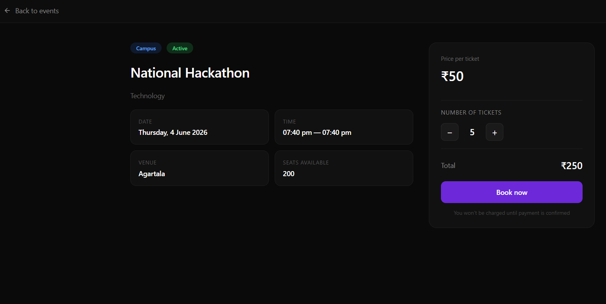
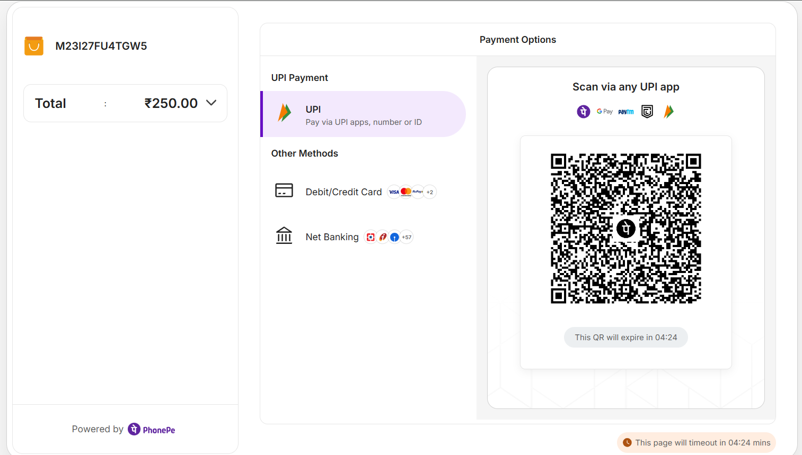
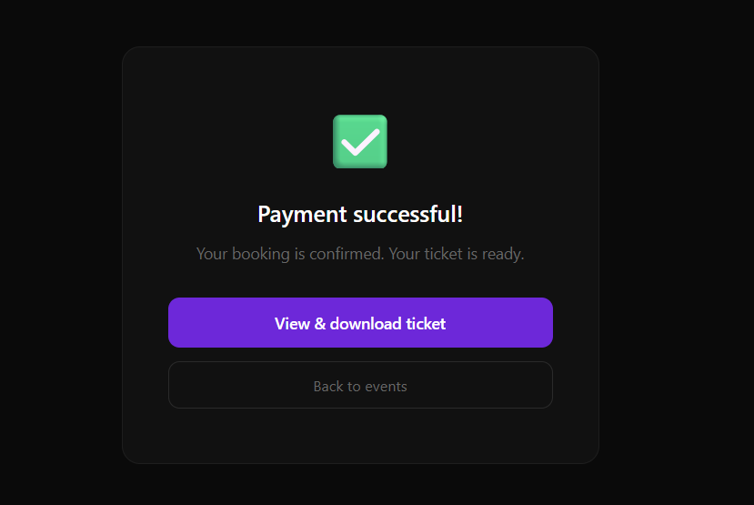
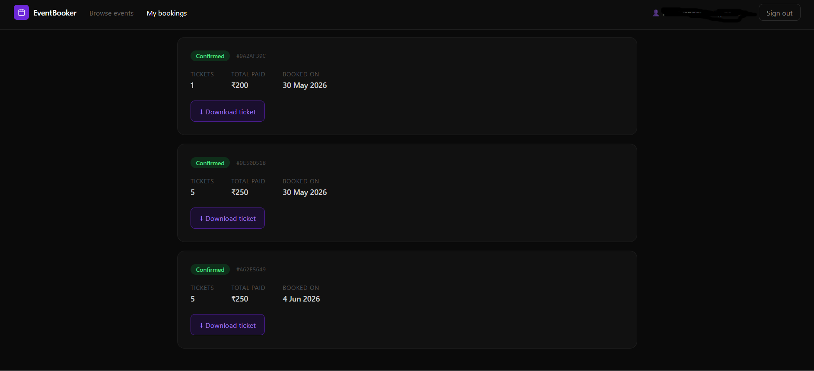
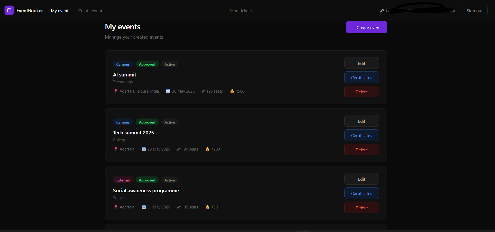
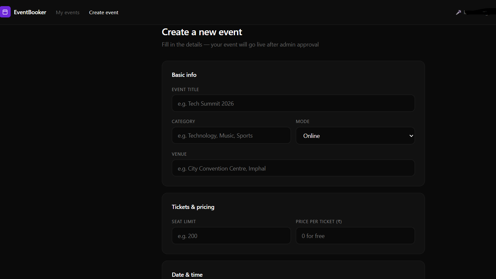
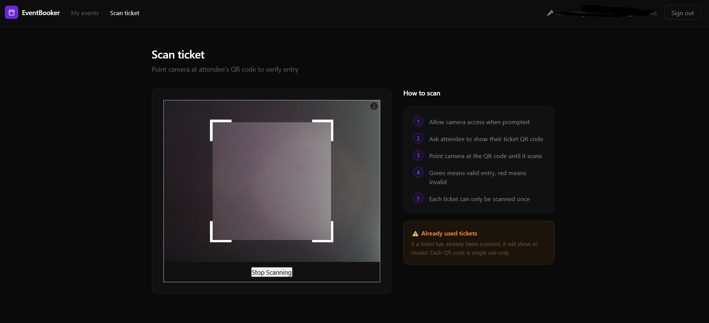
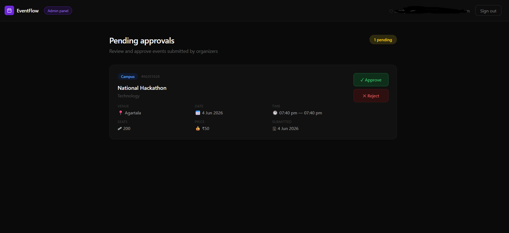

## EventBooker: An Event Management And Ticket Booking System

Event management and ticket booking system is a full-stack web application that handles event management and allow Users to search events based on thier preffered filters and view events, it handles ticket booking , payments with transcational rollbacks,QR-encoded ticket generation and JWT-based user authentication. The organizers can host thier events and scan tickets for verfication, with certificate generation and mailing system.

## Features

- 🔑**User Authentication**

- 🗓️**Event creation and management**

- 📲**Ticket booking**

- 💳**Payment gateway integration**

- 🎫**QR code tickets**

- 🛡️**Admin Dashborad**

- 📧**Email Notifications**

## Tech Stack

| Category | Technologies |
|-----------|-------------|
| Frontend | React, Vite, CSS |
| Backend | Node.js, Express.js |
| Database | MongoDB | Mongoose ODM
| Authentication | JWT |
| Payments | PhonePe |
| Email Service | Resend |
| Deployment | Vercel, Render |

## Live Demo
[Visit website](https://www.eventbooker.online/)

## Screenshots

## Landing Page
🌐Link: 

## Login and Register Page


## Users

## DiscoverEvents


## View Events


## PhonePe Payment Gateway


## Booking confirmation


## Download Tickets and My bookings page


## Organizers Dashboard


## Create Events


## Scan Tickets


## Admin Dashboard



## Architecture and work flow diagram

The overview of the system's architecture:


Payment and booking workflow:


Post-event workflow(scanning,verification and certificate giveaways):


# Installation Guide

## Prerequisites

Make sure you have the following installed before starting:

| Tool | Version | Download |
|------|---------|----------|
| Node.js | v18 or higher | https://nodejs.org |
| npm | comes with Node.js | — |
| MongoDB | v6 or higher | https://www.mongodb.com/try/download/community |
| Git | any recent version | https://git-scm.com |

---

## 1. Clone the repository

```bash
git clone https://github.com/Khaswrang668/Project-1-Event-Management-And-Ticket-Booking-System.git
cd your-repo-name
```

---

## 2. Backend setup

### Install dependencies

```bash
cd backend
npm install
```

### Create the environment file

Create a file named `.env` inside the `backend/` folder:

```bash
# backend/.env

PORT=3000
MONGO_DB_URI=mongodb://localhost:27017/USERS_DATABASE

FRONTEND_URL=http://localhost:5173
BACKEND_URL=http://localhost:3000

NODE_ENV=development

# JWT
ACCESS_TOKEN_SECRET=your_access_token_secret_here
ACCESS_TOKEN_EXPIRY=1d
REFRESH_TOKEN_SECRET=your_refresh_token_secret_here
REFRESH_TOKEN_EXPIRY=7d

# PhonePe (get from https://developer.phonepe.com)
PHONEPE_CLIENT_ID=your_phonepe_client_id
PHONEPE_CLIENT_SECRET=your_phonepe_client_secret
PHONEPE_CLIENT_VERSION=1
PHONEPE_WEBHOOK_USERNAME=your_webhook_username
PHONEPE_WEBHOOK_PASSWORD=your_webhook_password
PHONEPE_WEBHOOK_SECRET=your_webhook_secret

# Resend (get from https://resend.com)
RESEND_API_KEY=your_resend_api_key
```

> **Note:** Never commit your `.env` file to GitHub. Make sure `.env` is listed in your `.gitignore`.

### Start the backend server

```bash
npm run dev
```

The server will start at `http://localhost:3000`.

---

## 3. Frontend setup

Open a new terminal tab/window.

### Install dependencies

```bash
cd frontend
npm install
```

### Create the environment file

Create a file named `.env` inside the `frontend/` folder:

```bash
# frontend/.env

VITE_API_BASE_URL=http://localhost:3000/api/v1
```

### Start the frontend dev server

```bash
npm run dev
```

The app will open at `http://localhost:5173`.

---

## 4. Verify everything is running

Once both servers are up, you should see:

- **Frontend** → `http://localhost:5173` — the landing page loads
- **Backend** → `http://localhost:3000` — the API is accepting requests
- **MongoDB** → connected (check backend terminal for `server is running at port http://localhost:3000`)

---

## 5. Folder structure

```
project-root/
├── backend/
│   ├── controllers/
│   ├── models/
│   ├── routes/
│   ├── middlewares/
│   ├── db/
│   ├── utils/
│   ├── app.js
│   ├── index.js
│   └── .env          ← you create this
│
└── frontend/
    ├── src/
    │   ├── pages/
    │   ├── components/
    │   ├── context/
    │   ├── api/
    │   └── routes/
    ├── index.html
    └── .env          ← you create this
```

---

## 6. Environment variables reference

### Backend

| Variable | Description |
|----------|-------------|
| `PORT` | Port the Express server runs on |
| `MONGO_DB_URI` | MongoDB connection string |
| `FRONTEND_URL` | Allowed CORS origin |
| `BACKEND_URL` | Your backend's public URL |
| `NODE_ENV` | `development` or `production` |
| `ACCESS_TOKEN_SECRET` | Secret key for JWT access tokens |
| `ACCESS_TOKEN_EXPIRY` | Access token expiry e.g. `1d` |
| `REFRESH_TOKEN_SECRET` | Secret key for JWT refresh tokens |
| `REFRESH_TOKEN_EXPIRY` | Refresh token expiry e.g. `7d` |
| `PHONEPE_CLIENT_ID` | PhonePe API client ID |
| `PHONEPE_CLIENT_SECRET` | PhonePe API client secret |
| `PHONEPE_CLIENT_VERSION` | PhonePe API version |
| `PHONEPE_WEBHOOK_USERNAME` | PhonePe webhook basic auth username |
| `PHONEPE_WEBHOOK_PASSWORD` | PhonePe webhook basic auth password |
| `PHONEPE_WEBHOOK_SECRET` | PhonePe webhook signature secret |
| `RESEND_API_KEY` | Resend email service API key |

### Frontend

| Variable | Description |
|----------|-------------|
| `VITE_API_BASE_URL` | Base URL for all API calls |

---

## Common issues

**MongoDB not connecting**
Make sure MongoDB is running locally. On most systems:
```bash
# macOS / Linux
mongod --dbpath /data/db

# Windows
net start MongoDB
```

**Port already in use**
Change `PORT` in your backend `.env` to another value like `3001`, and update `VITE_API_BASE_URL` in your frontend `.env` to match.

**Puppeteer fails on first run**
Puppeteer downloads Chromium automatically during `npm install`. If it fails, run:
```bash
npx puppeteer browsers install chrome
```