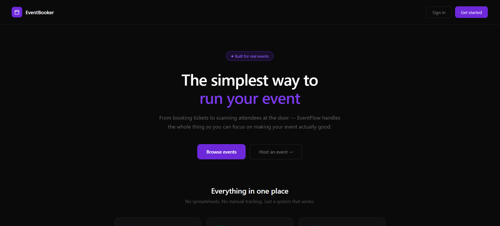
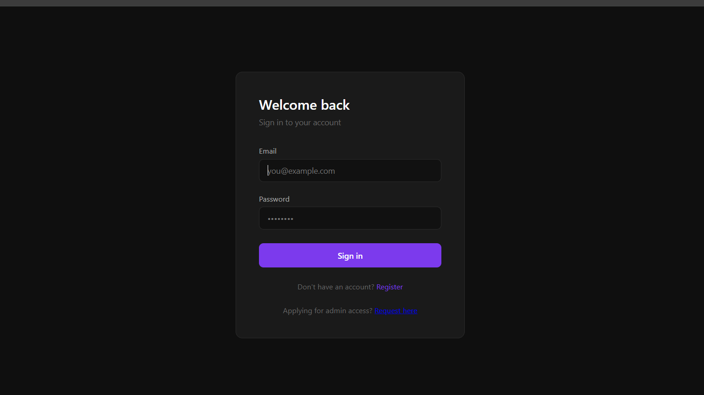
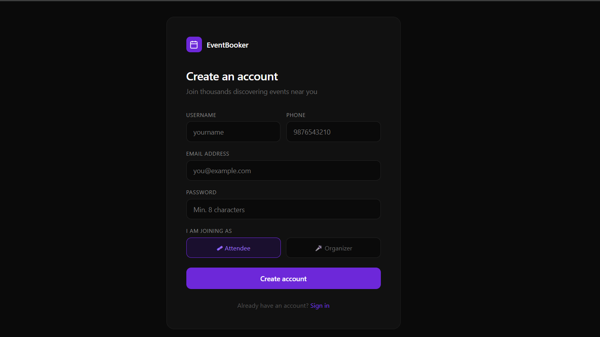
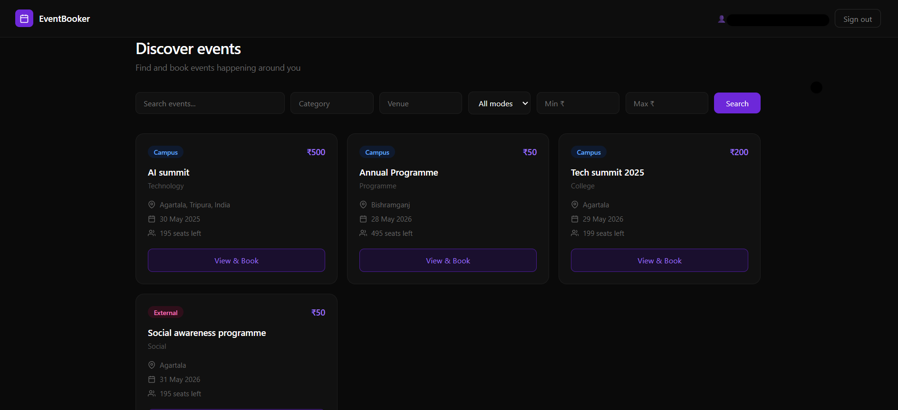

## EventBooker: An Event Management And Ticket Booking System

Event management and ticket booking system is a full-stack web application that handles event management and allow Users to search events based on thier preffered filters and view events, it handles ticket booking , payments with transcational rollbacks,QR-encoded ticket generation and JWT-based user authentication. The organizers can host thier events and scan tickets for verfication, with certificate generation and mailing system.

## Features

- 🔑**User Authentication**

- 🗓️**Event creation and management**

- 📲**Ticket booking**

- 💳**Payment gateway integration**

- 🎫**QR code tickets**

- 🛡️**Admin Dashborad**

- 📧**Email Notifications**

## Tech Stack

| Category | Technologies |
|-----------|-------------|
| Frontend | React, Vite, CSS |
| Backend | Node.js, Express.js |
| Database | MongoDB | Mongoose ODM
| Authentication | JWT |
| Payments | PhonePe |
| Email Service | Resend |
| Deployment | Vercel, Render |

## Screenshots

## Landing Page

## Login and Register Page

## Users

## DiscoverEvents

## View Events
